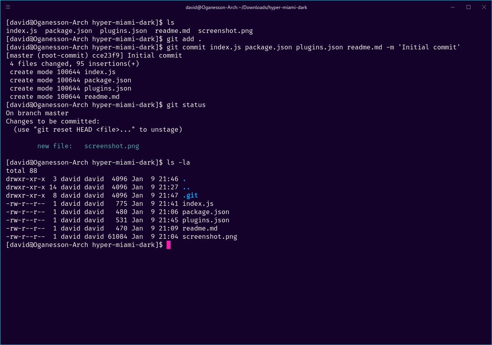

# hyper-miami-dark

[Hyper](https://hyper.is) theme based on [https://drasite.com/flat-remix-gnome](Flat Remix Miami Dark) and [https://github.com/ThibaudJeannin/adapta-gtk-miami-theme](Adapta GTK Miami)
This is a fork of [https://github.com/aranajhonny/hyper-criollo/](hyper-criollo)

## Install

Add `hyper-miami-dark` to the plugins list in your `~/.hyper.js` config file.

## License

MPL-2 © [David Doorn](https://github.com/thedjdoorn)
